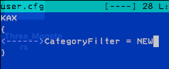
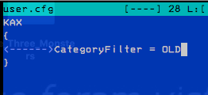
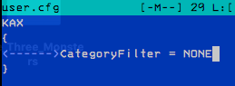
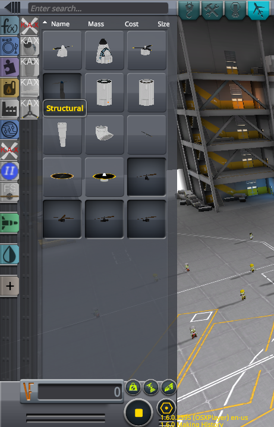
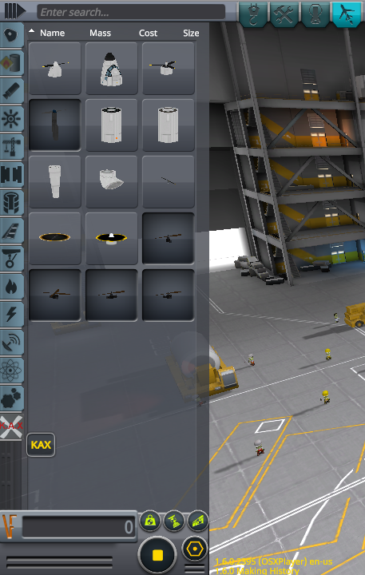

# KAX /L : Under New Management

Kerbal Aircraft Expansion /L - Under Lisias Management,

**FOREVER** _THE_ pack of select vanilla-inspired parts for your aircrafting needs!

## In a Hurry

* [Source](https://github.com/net-lisias-ksp/KAX)
	+ [Issue Tracker](https://github.com/net-lisias-ksp/KAX/issues)
	+ [History](https://github.com/net-lisias-ksp/KAX/tree/History)
* Documentation
	+ [Forum](https://forum.kerbalspaceprogram.com/index.php?/topic/180268-*)
	+ [Homepage](http://ksp.lisias.net/add-ons/KAX) on L Aerospace KSP Division
	+ [Project's README](https://github.com/net-lisias-ksp/KAX/blob/master/README.md)
	+ [Install Instructions](https://github.com/net-lisias-ksp/KAX/blob/master/INSTALL.md)
	+ [Change Log](./CHANGE_LOG.md)
	+ [Known Issues](./KNOWN_ISSUES.md)
* Official Distribution Sites:
	+ [Homepage](http://ksp.lisias.net/add-ons/KAX) on L Aerospace
	+ [Source and Binaries](https://github.com/net-lisias-ksp/KAX) on GitHub.
	+ [Latest Release](https://github.com/net-lisias-ksp/KAX/releases)
		- [Binaries](https://github.com/net-lisias-ksp/KAX/tree/Archive)

## Description

A Mod for Kerbal Space Program

Originally created by Keptin, then maintained by SpannerMonkey and the SM Industries team, and now under Lisias Management, KAX is a pack of select vanilla-inspired parts for your aircrafting needs!

Included Parts:

- Turboprop
- Radial Engine
- Electric Propeller
- Helicopter Main Rotor
- Helicopter Tail Rotor
- Heavy Landing Gear
- Jump Jet Engine
- 2M Aircraft Cockpit
- 2M Fuselage (jet fuel)
- 2M Structural Fuselage (empty)
- 2M Tail Boom 

Extract the KAX folder, into your KSP Gamedata folder.  

Be sure to properly extract the Firespitter/Resources folder or you will have FScoolant errors on loading the electric prop.  

This mod Requires Firespitter and Module Manager to enable all the features. Please use the latest versions of their .dll plugins.

### Configuration

Now you can choose how to handle your KAX parts and future new enhancements by editing the file `<KSP_ROOT>PluginData/KAX/user.cfg` that will be automatically created by KAX on the first run.

#### VAB/SPH Parts Menu

You can choose between three options:

* New Advanced Menu
	+ `CategoryFilter = NEW`
	+ 
* Old, classic Menu
	+ `CategoryFilter = OLD`
	+ 
* No specialized menu at all
	+ `CategoryFilter = NONE`
	+ 

The new Advanced Menu has shows only KAX parts with submenus specialised by category:

The old, classic menu is a old friend: all KAX parts on the same category on the simplified menu:

People using [Community Category Kit](https://forum.kerbalspaceprogram.com/index.php?/topic/149840-discussion-community-category-kit/) would want to disable the menu at all, as CCK already handles all of that.

### Project Directives

This Management (Lisias) had agreed to oblige himself to the following directives for this project:

* **KAX will remain KAX**
	+ it will not be rolled into another mod
	+ it can be expanded
		- expansions must be in keeping with the tone of the mod
		- it must be vaguely (as much as possible) stockalike. 

## Installation

Detailed installation instructions are now on its own file (see the [In a Hurry](#in-a-hurry) section) and on the distribution file.

### License

+ [GPL 3.0](https://www.gnu.org/licenses/gpl-3.0.txt). See [here](./LICENSE)
	+ You are free to:
		- Use : unpack and use the material in any computer or device
		- Redistribute : redistribute the original package in any medium
		- Adapt : Reuse, modify or incorporate source code into your works (and redistribute it!) 
	+ Under the following terms:
		- You retain any copyright notices
		- You recognize and respect any trademarks
		- You don't impersonate the authors, neither redistribute a derivative that could be misrepresented as theirs.
		- You credit the author and republish the copyright notices on your works where the code is used.
		- You relicense (and fully comply) your works using GPL 3.0 (or later)
		- You don't mix your works with GPL incompatible works.

Please note the copyrights and trademarks in [NOTICE](./NOTICE).

### Acknowledgements

Stockalike textures by [Doctor Davinci](https://forum.kerbalspaceprogram.com/index.php?/profile/150019-doctordavinci/)

## References

* [SpannerMonkey(smce)](https://forum.kerbalspaceprogram.com/index.php?/profile/50907-spannermonkeysmce/) -- Previous Maintainer
	+ [Forum](https://forum.kerbalspaceprogram.com/index.php?/topic/166467-kerbal-aircraft-expansion-_continued/)
	+ [GitHub](https://github.com/SpannerMonkey/KAX)
* [Keptin](https://forum.kerbalspaceprogram.com/index.php?/profile/8884-keptin/) -- Original Author
	+ [Forum](https://forum.kerbalspaceprogram.com/index.php?/topic/155448-122-kerbal-aircraft-expansion-kax-v264/&)
	+ [Curse Forge](https://kerbal.curseforge.com/projects/kerbal-aircraft-expansion-kax/files/2358481)
